# Отчет по лабораторной работе №5
### Задание
1. Ознакомиться с классификаторами библиотеки **Scikit-learn**.
2. Выбрать для исследования не менее 3 классификаторов.
3. Выбрать набор данных для задач классификации из открытых источников.
4. Для каждого классификатора определить целевой столбец и набор признаков. Обосновать свой выбор. При необходимости 
преобразовать типы признаковых данных.
5. Подготовить данные к обучению.
6. Провести обучение и оценку моделей на сырых данных.
7. Провести предобработку данных.
8. Провести обучение и оценку моделей на очищенных данных.
9. Проанализировать результаты.
10. Результаты представить в табличной и графической форме.
11. Сформулировать выводы.

### Выполнение работы
Для работы я выбрала набор данных, содержащий обширное количество записей о пациентах с диагнозом COVID-19.
Главной целью являлось обучить модель так, чтобы она смогла точно предсказывать, находится ли пациент в группе риска или нет,
базируясь на текущих симптомах, статусе, медицинской истории.

Поскольку данный датасет имеет узко специализированные медицинские данные, необходимо пояснить назначение каждого столбца.
1. ***USMER*** - уровень медицинского учреждения, в котором была оказана помощь
2. ***MEDICAL_UNIT*** - институт Национальной Системы Здравоохранения, которая оказывала помощь
3. ***SEX*** - пол пациента
4. ***PATIENT_TYPE*** - госпитализирован / не госпитализирован
5. ***DATE_DIED*** - дата смерти пациента или пометка о выписке (значение **9999-99-99** означает выписку пациента)
6. ***INTUBED*** - был ли пациент подключен к аппарату ИВЛ или нет
7. ***PNEUMONIA*** - была ли у пациента пневмония или нет
8. ***AGE*** - возраст пациента
9. ***PREGNANT*** - наличие беременности у пациента
10. ***DIABETES*** - наличие диабета у пациента
11. ***COPD*** - наличие хронической обструктивной болезни легких (ХОБЛ)
12. ***ASTHMA*** - наличие бронхиальной астмы у пациента
13. ***INMSPR*** - наличие иммуносупрессии у пациента
14. ***HIPERTENSION*** - наличие гипертонии у пациента
15. ***OTHER_DISEASE*** - наличие прочих заболеваний у пациента
16. ***CARDIOVASCULAR*** - наличие заболеваний сердечно-сосудистой системы у пациента
17. ***OBESITY*** - наличие ожирения у пациента
18. ***RENAL_CHRONIC*** - наличие у пациента хронических болезней почек
19. ***TOBACCO*** - является ли пациент курильщиком
20. ***CLASSIFICATION_FINAL*** - результаты теста на COVID-19
21. ***ICU*** - был ли пациент перемещен в реанимацию

Для достижения этой цели были выбраны следующие классификаторы библиотеки **Scikit-learn**:
+ Метод k-ближайших соседей
+ Классификатор дерева решений
+ Наивный баесовский метод
+ Линейный дискриминантный анализ

После считывания датасета из csv-файла было решено провести обучение на сырых данных, но результаты оказались неадекватными и практически все пациенты были зачислеы в группу риска.
Данные результаты объясняются тем, что пропуски данных в таблице обозначались значениями 97 и 99.

Далее была произведена "очистка" данных. 
1. Удаляем все строки, где данные пропущены. Для этого фильтруем данные, оставляя только значения с малыми значениями данных (1 - наличие признака, 2 - отсутствие).
2. Заменяем все 2 на 0, для обозначения отсутствия того или иного признака.
3. Выведем для всех столбцов распределение значений графически для того, чтобы определить, какие из столбцов будут лишними.  
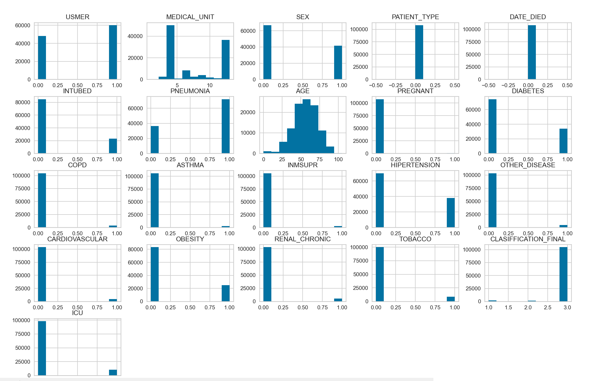  
4. После анализа значений принято решение удалить столбцы:
    + ***CLASSIFICATION_FINAL***, поскольку при очистке данных мы исключили строки со значением 4 (результаты теста неубедительны), оставив только значение 1-3 (COVID-19 обнаружен в разной степени). Следовтельно, все пациенты имеют одинаковый диагноз, и этот столбец смысла не имеет
    + ***PREGNANT***, поскольку все пациенты не беременны
    + ***MEDICAL_UNIT***, поскольку данный факт не имеет прямого влияния на причисление пациента в группу риска, а разбросом значений может ухудшить качество классификации
    + ***PATIENT_TYPE***, поскольку все пациенты госпитализированы

Далее датасет был разделен на тренировочный и тестовый наборы и поочереди обучен на каждом из четырех описанных выше классификаторах.

Табличный результат для **метода k-ближайших соседей**:  
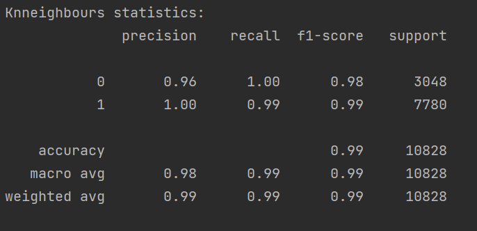  
Графическое отображение классификации:  
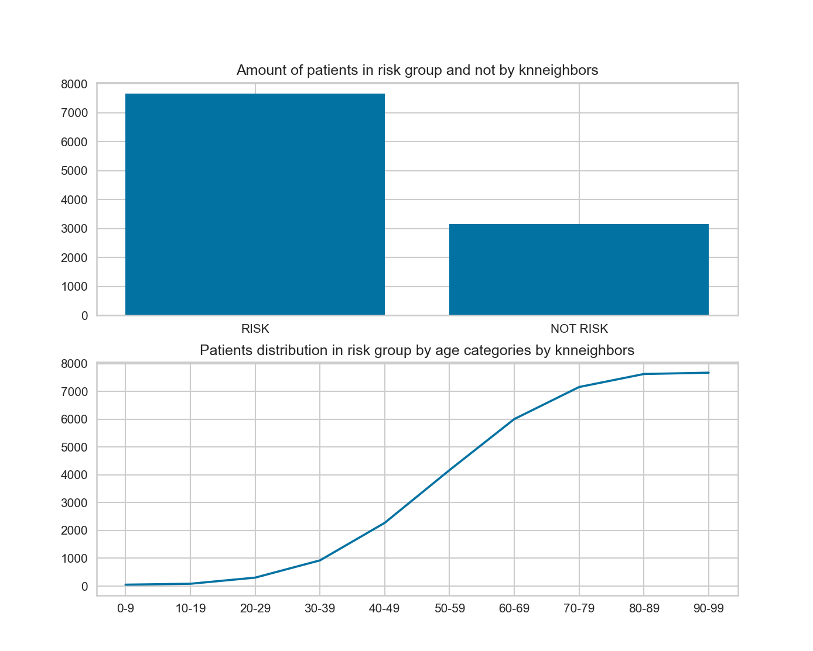  
**Confusion matrix** (матрица ошибок):  
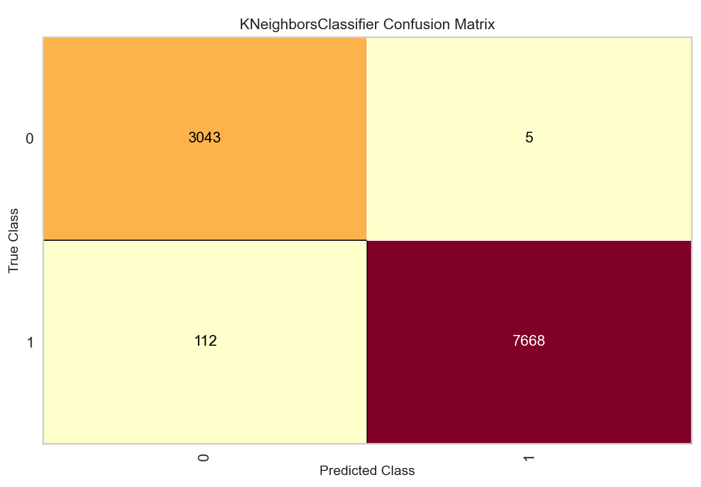  
*3043 - true positive, 5 - fake positive; 
7668 - true negative, 112 - fake negative.*

Табличный результат для **классификатора дерева решений**:  
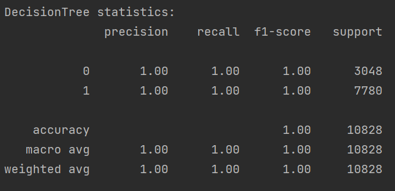  
Графическое отображение классификации:  
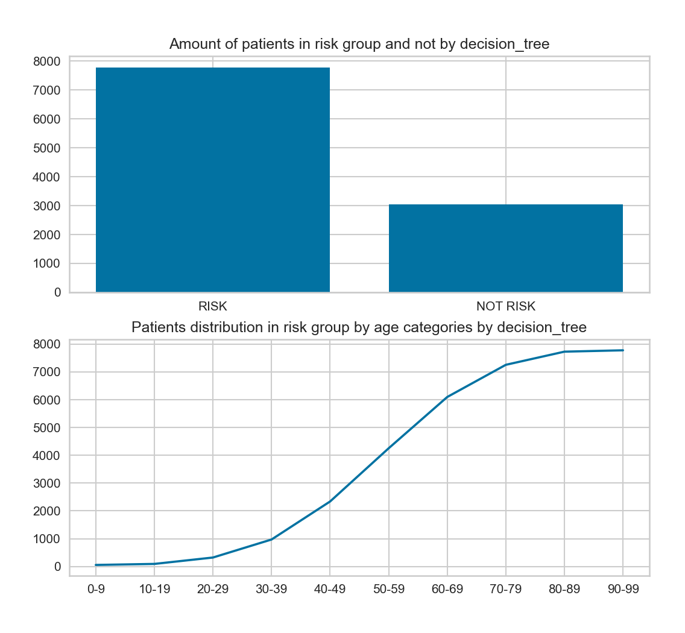  
**Confusion matrix** (матрица ошибок):  
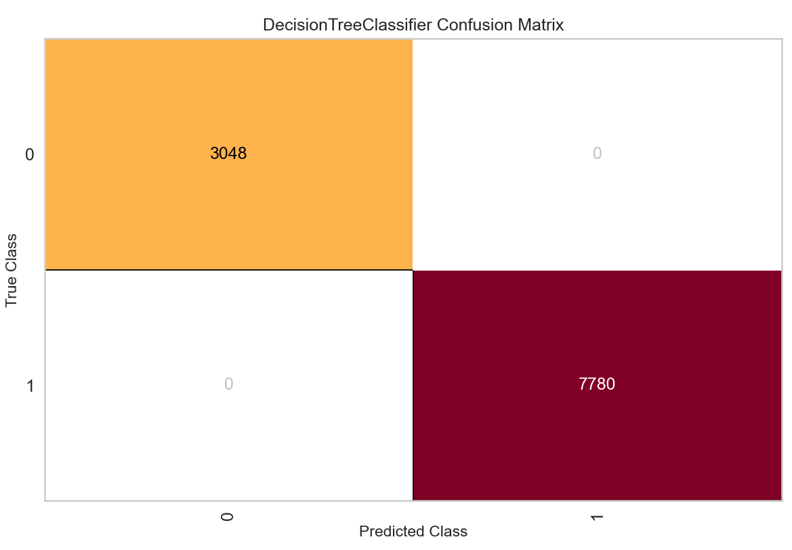  
*3048 - true positive, 0 - fake positive; 
7780 - true negative, 0 - fake negative.*

Табличный результат для **наивного баесовского метода**:  
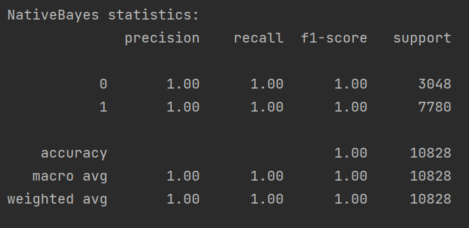  
Графическое отображение классификации:  
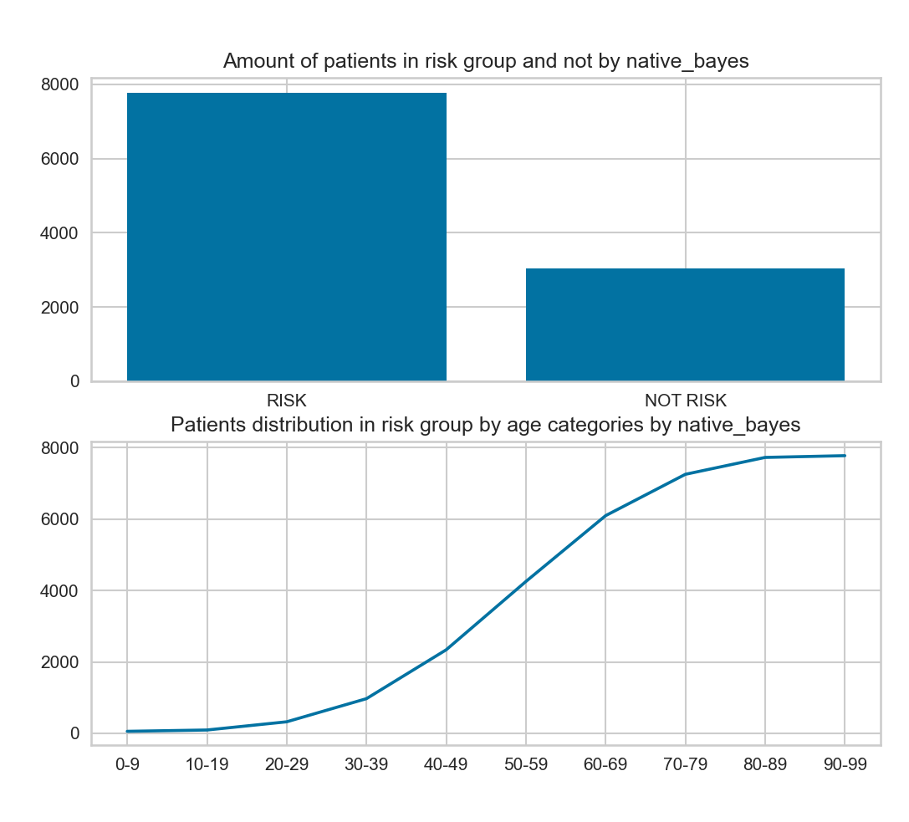  
**Confusion matrix** (матрица ошибок):  
  
*3048 - true positive, 0 - fake positive; 
7780 - true negative, 0 - fake negative.*

Табличный результат для **линейного дискриминантного анализа**:  
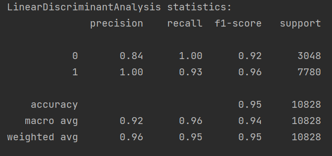  
Графическое отображение классификации:  
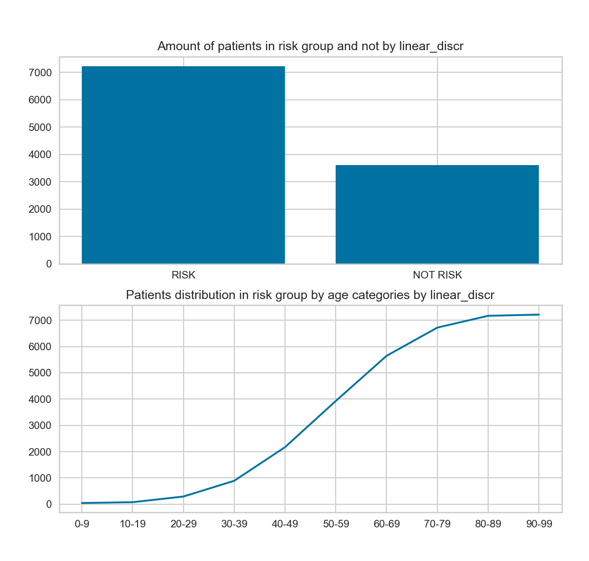  
**Confusion matrix** (матрица ошибок):  
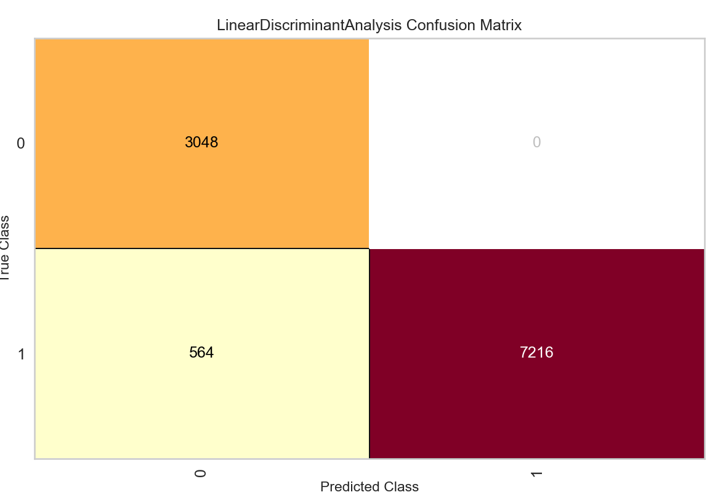  
*3048 - true positive, 0 - fake positive; 
7216 - true negative, 564 - fake negative.*

Сравнительная характеристика методов классификации:  
  

Исходя из этого графика и табличных характеристик, можно сделать вывод о том, что наиболее точными в классификации в данном случае являются наивный баесовский метод и 
классификатор дерева решений.
